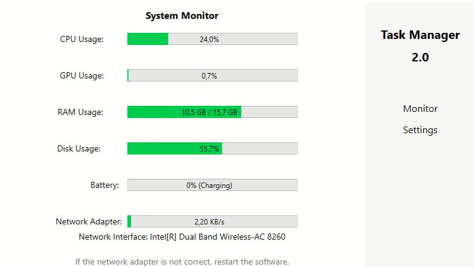
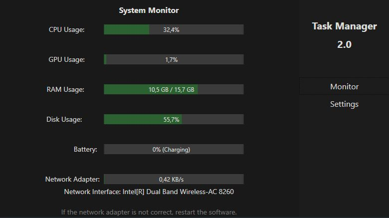

  
  
  
  
  

  <h3 align="center">Computer Components Tracker</h3>

  

    Also known as, Task Manager 2.0
     
    <a href="https://github.com/wildREA/computerComponentsTracker"><strong>Explore the docs »</strong></a>
     
  

<!-- TABLE OF CONTENTS -->

  
Table of Contents

  <ol>
    <li>
      <a href="#about-the-project">About The Project</a>
      <ul>
        <li><a href="#built-with">Built With</a></li>
      </ul>
    </li>
    <li>
      <a href="#getting-started">Getting Started</a>
      <ul>
        <li><a href="#installation">Installation</a></li>
      </ul>
    </li>
    <li><a href="#usage">Usage</a></li>
    <li><a href="#roadmap">Roadmap</a></li>
    <li><a href="#contributing">Contributing</a></li>
    <li><a href="#license">License</a></li>
    <li><a href="#contact">Contact</a></li>
    <li><a href="#acknowledgments">Acknowledgments</a></li>
  </ol>

<!-- ABOUT THE PROJECT -->
## About The Project

This is a software application made with .NET as a Window Presentation Form (WPF). The purpose of the software is to display hardware statistics. Although, I realized that I had accidentally made a Task Manager version 2.0.
Since this is my project, it's of course a better version of Microsoft's Task Manager.

Features:
* All values are displayed in their correct and common formats when looking at their types. (E.g. network usage; sent and received bytes are mostly looked at in MB/s or KB/s.)
* The values are quite sensitive, so you will likely get "jumpier" spikes in values. Fortunately, that will result in more correct data with an update internal of 1-second.
* The software is sleek and minimalistic. (I plan to create a kind of theme adjustment (classic Windows XP & modern appearance).)

(<a href="#readme-top">back to top</a>)

### Built With

* 
* 
* 

(<a href="#readme-top">back to top</a>)

<!-- GETTING STARTED -->
## Getting Started

This is an example of how you may give instructions on setting up your project locally.
To get a local copy up and running follow these simple example steps.

### Installation

_The software does not require a specific .NET Runtime to work. It is self-contained._

1. Get the latest version at [Releases](https://github.com/wildREA/computerComponentsTracker/tags)
2. Extract the `.zip` folder's files into a personally preferred location
3. Run taskmanagerv2.exe
5. Click `Install`

The software will automatically run after installation, resulting in popping up on your screen. You should be able to see different hardware statistics of your system.
Do not worry about an Unknown Publisher warning. It usually stems from an unsigned software.

(<a href="#readme-top">back to top</a>)

<!-- USAGE EXAMPLES -->
## Usage

The native way to use the software is simply visually. Any other features are not a part of the fundamentals for it to work to match the aforementioned purpose of the software.

<!-- PROJECT LOGO -->
 

  
  

(<a href="#readme-top">back to top</a>)

<!-- ROADMAP -->
## Roadmap

- [x] Add Readme
- [x] Add Releases
- [ ] Add Network Usage options;
    - [X] Auto (Selects first found active network interface adapter.)
    - [ ] Selective (User can select which of found interface adapters; by software, to choose from) - report any issues in the future regarding iteration logic
- [x] Add GPU Usage Tracker
- [ ] Add Light/Dark mode (likely remember setting)
- [x] Multi-language Support
    - [x] (Arabic) العربية
    - [x] (Persian) فارسی
    - [x] Deutsch (German)
    - [x] Ελληνικά (Greek)
    - [x] English (American)
    - [x] Français (French)
    - [x] (Hebrew) עברית
    - [x] हिंदी (Hindi)
    - [x] Italiano (Italian)
    - [x] 日本語 (Japanese)
    - [x] Lietuvių (Lithuanian)
    - [x] Nederlands (Dutch)
    - [x] 普通话 (Mandarin)
    - [x] Polski (Polish)
    - [x] Português (Brasileiro) (Portuguese - Brazilian)
    - [x] Русский (Russian)
    - [x] ภาษาไทย (Thai)
    - [x] Türkçe (Turkish)
    - [x] (Lebanese) لبناني

(<a href="#readme-top">back to top</a>)

<!-- CONTRIBUTING -->
## Contributing

Contributions are what make the open source community such an amazing place to learn, inspire, and create. Any contributions you make are **greatly appreciated**.

If you have a suggestion that would make this better, please fork the repo and create a pull request. You can also simply open an issue with the tag "enhancement".
Don't forget to give the project a star! Thanks again!

1. Fork the Project
2. Create your Feature Branch (`git checkout -b feature/AmazingFeature`)
3. Commit your Changes (`git commit -m 'Add some AmazingFeature'`)
4. Push to the Branch (`git push origin feature/AmazingFeature`)
5. Open a Pull Request

(<a href="#readme-top">back to top</a>)

<!-- LICENSE -->
## License

Distributed under the CC-BY-SA-4.0 License. See `LICENSE.txt` for more information.

(<a href="#readme-top">back to top</a>)

<!-- CONTACT -->
## Contact

wildREA - wildrealinit@example.com

Project Link: [https://github.com/wildREA/computerComponentsTracker](https://github.com/wildREA/computerComponentsTracker)

(<a href="#readme-top">back to top</a>)

<!-- ACKNOWLEDGMENTS -->
## Acknowledgments

Use this space to list resources you find helpful and would like to give credit to. I've included a few of my favorites to kick things off!

* [Choose an Open Source License](https://choosealicense.com)
* [GitHub Emoji Cheat Sheet](https://www.webpagefx.com/tools/emoji-cheat-sheet)
* [Malven's Flexbox Cheatsheet](https://flexbox.malven.co/)
* [Malven's Grid Cheatsheet](https://grid.malven.co/)
* [Img Shields](https://shields.io)
* [GitHub Pages](https://pages.github.com)
* [Font Awesome](https://fontawesome.com)
* [React Icons](https://react-icons.github.io/react-icons/search)

(<a href="#readme-top">back to top</a>)

<!-- MARKDOWN LINKS & IMAGES -->
<!-- https://www.markdownguide.org/basic-syntax/#reference-style-links -->
[contributors-shield]: https://img.shields.io/github/contributors/othneildrew/Best-README-Template.svg?style=for-the-badge
[contributors-url]: https://github.com/othneildrew/Best-README-Template/graphs/contributors
[forks-shield]: https://img.shields.io/github/forks/othneildrew/Best-README-Template.svg?style=for-the-badge
[forks-url]: https://github.com/othneildrew/Best-README-Template/network/members
[stars-shield]: https://img.shields.io/github/stars/othneildrew/Best-README-Template.svg?style=for-the-badge
[stars-url]: https://github.com/othneildrew/Best-README-Template/stargazers
[issues-shield]: https://img.shields.io/github/issues/othneildrew/Best-README-Template.svg?style=for-the-badge
[issues-url]: https://github.com/othneildrew/Best-README-Template/issues
[license-shield]: https://img.shields.io/github/license/othneildrew/Best-README-Template.svg?style=for-the-badge
[license-url]: https://github.com/othneildrew/Best-README-Template/blob/master/LICENSE.txt
[linkedin-shield]: https://img.shields.io/badge/-LinkedIn-black.svg?style=for-the-badge&logo=linkedin&colorB=555
[linkedin-url]: https://linkedin.com/in/othneildrew
[product-screenshot]: images/screenshot.png
[Next.js]: https://img.shields.io/badge/next.js-000000?style=for-the-badge&logo=nextdotjs&logoColor=white
[Next-url]: https://nextjs.org/
[React.js]: https://img.shields.io/badge/React-20232A?style=for-the-badge&logo=react&logoColor=61DAFB
[React-url]: https://reactjs.org/
[Vue.js]: https://img.shields.io/badge/Vue.js-35495E?style=for-the-badge&logo=vuedotjs&logoColor=4FC08D
[Vue-url]: https://vuejs.org/
[Angular.io]: https://img.shields.io/badge/Angular-DD0031?style=for-the-badge&logo=angular&logoColor=white
[Angular-url]: https://angular.io/
[Svelte.dev]: https://img.shields.io/badge/Svelte-4A4A55?style=for-the-badge&logo=svelte&logoColor=FF3E00
[Svelte-url]: https://svelte.dev/
[Laravel.com]: https://img.shields.io/badge/Laravel-FF2D20?style=for-the-badge&logo=laravel&logoColor=white
[Laravel-url]: https://laravel.com
[Bootstrap.com]: https://img.shields.io/badge/Bootstrap-563D7C?style=for-the-badge&logo=bootstrap&logoColor=white
[Bootstrap-url]: https://getbootstrap.com
[JQuery.com]: https://img.shields.io/badge/jQuery-0769AD?style=for-the-badge&logo=jquery&logoColor=white
[JQuery-url]: https://jquery.com 
